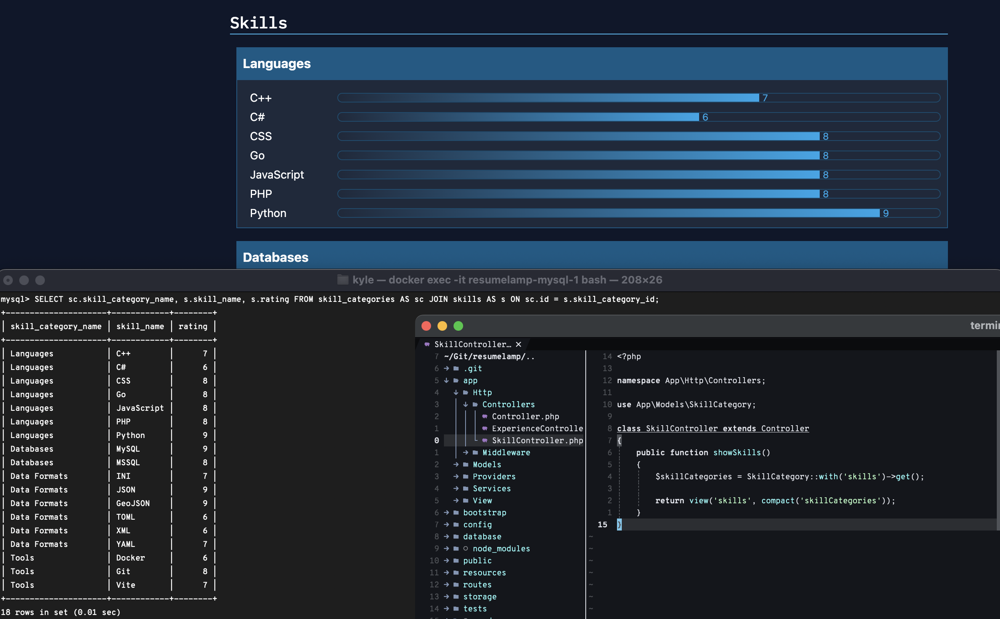
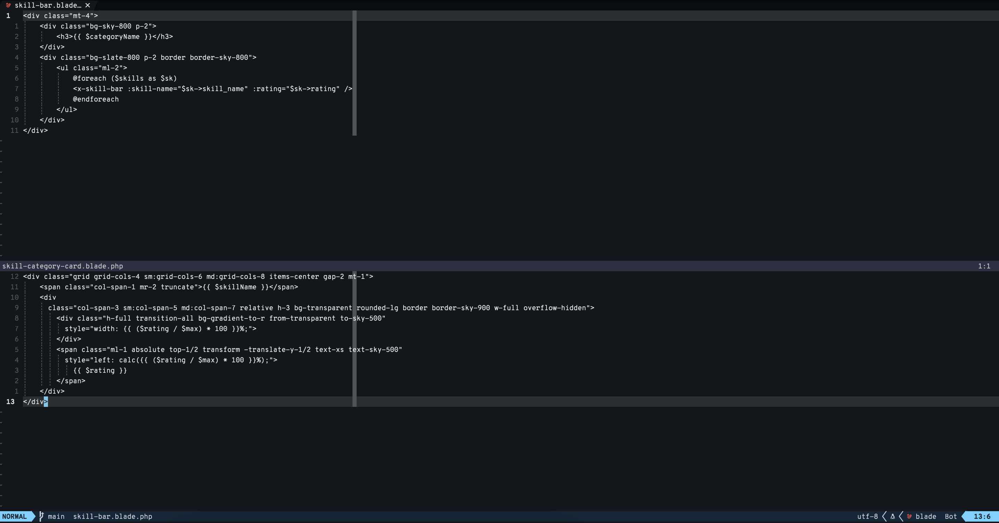
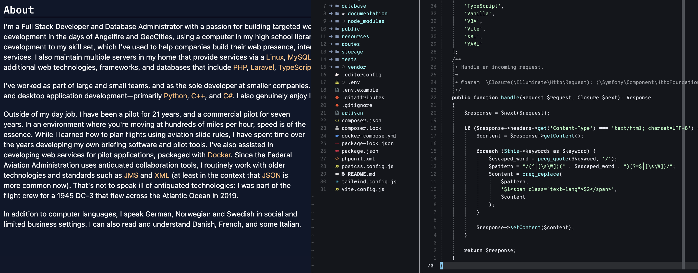

# Resume Project: LAMP

## Overview

-   **Purpose**: This is an example Laravel application built to demonstrate experience with a modern LAMP stack.
-   **Technologies**: Laravel 11 with MySQL, Sail, TailwindCSS, and Vite.

## Contact Information

-   [GitHub](https://github.com/misterrodg)
-   [LinkedIn](https://www.linkedin.com/in/krodg/)

## Features

-   Database migrations to show familiarity with migrations and seeding.
-   Routing via Controllers, with and without middleware. Additional ad hoc routing.
-   Helper Services for date and number handling.
-   Middleware to highlight specific code languages that appear within the middleware route group.
-   Blade Components used to reduce code duplication.

## Installation and Setup

1. Prerequisites:

    - PHP (v8.2 or later)
    - Composer
    - Docker

2. Clone the repository:

```bash
git clone https://github.com/misterrodg/resumelamp.git
cd resumelamp
```

3. Install Dependencies:

```bash
composer install
npm install
```

4. Configure Environment

```bash
cp .env.example .env
```

NOTE: This project uses the credentials in the `.env.example` for simplicity, and because this is not a production-ready project.

5. Start the Development Server

```bash
./vendor/bin/sail up
```

```bash
npm run dev
```

6. Run Migrations and Seed Database

```bash
./vendor/bin/sail artisan migrate --seed
```

## Usage

Access the app in a browser at `http://localhost`

## Screenshots

### MVC Demo

Demonstration of representative SQL query, being selected in the
[Skill Controller](./app/Http/Controllers/SkillController.php) via the
[Skill Category Model](./app/Models/SkillCategory.php), with the resulting render.



### Component Demo

Demonstration of the [Skill Bar Component](./resources/views/components/skill-bar.blade.php)
nested within the [Skill Category Component](./resources/views/components/skill-category-card.blade.php).
This reduces code duplication and standardizes styling without relying on accurate human entries.



### Middleware Demo

Demonstration of the [Highlight Keywords Middleware](./app/Http/Middleware/HighlightKeywords.php)
being used to highlight specific code languages, formats, frameworks, tools found in the page text.


